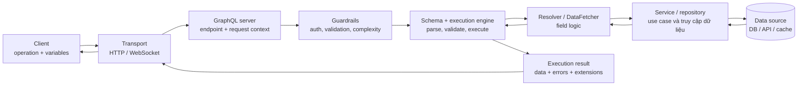

Một hệ thống GraphQL không chỉ gồm schema và một endpoint. Request đi qua **transport** (lớp vận chuyển) và vào **GraphQL server** (ứng dụng nhận, kiểm tra và thực thi request). Server đối chiếu request với **schema** (contract mô tả type và field). Sau đó, **execution engine** (bộ máy thực thi) giao từng field cho **resolver** hoặc **data fetcher** (logic cung cấp giá trị cho field). Resolver có thể gọi **service** (lớp thực hiện use case), **repository** (lớp trừu tượng hóa truy cập dữ liệu) và nhiều **data source** (nguồn dữ liệu) trước khi engine ghép kết quả trả về cho **client** (phần mềm gửi request).

Bài này xây dựng mental model (mô hình tư duy) cho toàn bộ đường đi đó. Mục tiêu là biết mỗi lớp sở hữu trách nhiệm nào và biết đặt một lỗi ở đúng lớp. GraphQL không phải database, ORM hay lời khẳng định rằng một request luôn tạo ra đúng một truy vấn backend.

<Callout type="info" title="Phạm vi và giả định">
Các sơ đồ, SDL, Java code và response trong bài là ví dụ độc lập để giải thích kiến trúc. Repository này là docs-only và không có backend Spring Boot để chạy; không nên hiểu các ví dụ là runtime đã được kiểm chứng trong repo. Endpoint `/graphql`, HTTP và tên package chỉ là giả định minh họa, có thể thay đổi theo ứng dụng thật.
</Callout>

## Mục lục

- [Bức tranh tổng thể](#bức-tranh-tổng-thể)
  - [Contract và implementation không phải một lớp](#contract-và-implementation-không-phải-một-lớp)
  - [Sơ đồ request qua các lớp](#sơ-đồ-request-qua-các-lớp)
- [Các thành phần trong kiến trúc](#các-thành-phần-trong-kiến-trúc)
  - [Client](#client)
  - [Transport](#transport)
  - [GraphQL server](#graphql-server)
  - [Schema và execution engine](#schema-và-execution-engine)
  - [Resolver và data fetcher](#resolver-và-data-fetcher)
  - [Service repository và data source](#service-repository-và-data-source)
  - [Context và error handling](#context-và-error-handling)
- [Luồng xử lý một request](#luồng-xử-lý-một-request)
  - [Bước 1 client tạo operation](#bước-1-client-tạo-operation)
  - [Bước 2 transport chuyển request](#bước-2-transport-chuyển-request)
  - [Bước 3 server tạo context và áp dụng guardrail](#bước-3-server-tạo-context-và-áp-dụng-guardrail)
  - [Bước 4 parse và validate với schema](#bước-4-parse-và-validate-với-schema)
  - [Bước 5 execution gọi resolver](#bước-5-execution-gọi-resolver)
  - [Bước 6 đi qua service repository và data source](#bước-6-đi-qua-service-repository-và-data-source)
  - [Bước 7 hoàn tất giá trị và xử lý lỗi](#bước-7-hoàn-tất-giá-trị-và-xử-lý-lỗi)
  - [Bước 8 transport trả kết quả cho client](#bước-8-transport-trả-kết-quả-cho-client)
- [Ví dụ hello và object với Java](#ví-dụ-hello-và-object-với-java)
  - [Schema là contract](#schema-là-contract)
  - [Resolver là implementation](#resolver-là-implementation)
  - [Query và execution result](#query-và-execution-result)
  - [Giả định của ví dụ](#giả-định-của-ví-dụ)
- [Boundary và ownership](#boundary-và-ownership)
  - [Ranh giới trách nhiệm](#ranh-giới-trách-nhiệm)
  - [Ownership của schema và field](#ownership-của-schema-và-field)
  - [Khi GraphQL server làm composition](#khi-graphql-server-làm-composition)
- [Guardrail quanh execution](#guardrail-quanh-execution)
  - [Authentication và authorization](#authentication-và-authorization)
  - [Validation và query complexity](#validation-và-query-complexity)
  - [N plus 1 và batch loading](#n-plus-1-và-batch-loading)
  - [Observability](#observability)
- [Đánh đổi khi đặt logic ở resolver](#đánh-đổi-khi-đặt-logic-ở-resolver)
  - [Dồn logic vào resolver](#dồn-logic-vào-resolver)
  - [Resolver truy cập data source trực tiếp](#resolver-truy-cập-data-source-trực-tiếp)
  - [Boundary thực dụng](#boundary-thực-dụng)
- [Đọc kiến trúc khi debug](#đọc-kiến-trúc-khi-debug)
  - [Bốn câu hỏi định vị lỗi](#bốn-câu-hỏi-định-vị-lỗi)
  - [Một request không phải một truy vấn backend](#một-request-không-phải-một-truy-vấn-backend)
- [Bước tiếp theo](#bước-tiếp-theo)

## Bức tranh tổng thể

Hãy đọc một request GraphQL từ trái sang phải. Client mô tả dữ liệu cần nhận. Server dùng schema để giới hạn vocabulary (bộ tên type và field) hợp lệ, rồi dùng resolver để biến từng field thành giá trị. Phần dữ liệu thật có thể đến từ một hoặc nhiều hệ thống phía sau.

### Contract và implementation không phải một lớp

**Schema** là contract (hợp đồng) công khai của GraphQL API. Schema nói client được yêu cầu operation nào, field nào tồn tại, argument nhận kiểu gì và response có hình dạng nào. Schema không nói câu SQL nào sẽ chạy, service nào được gọi hay dữ liệu nằm trong database nào.

**Implementation** (phần triển khai) là code và cấu hình thực hiện contract. Resolver, service, repository và data source thuộc implementation. Một field `hello: String!` có thể trả chuỗi cố định, đọc cấu hình, gọi service hoặc lấy từ một nguồn từ xa. Các lựa chọn đó không nhất thiết làm schema thay đổi.

| Câu hỏi | Lớp trả lời | Ví dụ |
| --- | --- | --- |
| Client được phép yêu cầu gì? | Schema và type system | `hello: String!`, `book: Book` |
| Field được lấy hoặc tính ra thế nào? | Resolver hoặc data fetcher | Gọi `catalogService.findFeatured()` |
| Quy tắc nghiệp vụ nằm ở đâu? | Service hoặc application layer | Kiểm tra sách có được công khai không |
| Dữ liệu gốc nằm ở đâu? | Data source | Database, REST service, cache hoặc bộ nhớ |
| Request đến và kết quả đi ra bằng gì? | Transport | HTTP, WebSocket hoặc transport khác |

Tách contract khỏi implementation giúp hai phía thay đổi độc lập hơn. Client có thể giữ nguyên query khi server đổi từ một database sang API downstream, miễn là contract và semantics (ngữ nghĩa) của field vẫn được giữ. Ngược lại, thêm field vào schema không tự tạo dữ liệu; implementation vẫn phải cung cấp field đó.

### Sơ đồ request qua các lớp

Sơ đồ sau là flow khái niệm. Mũi tên đi sang phải thể hiện request và việc resolve; mũi tên quay lại thể hiện dữ liệu về để engine hoàn tất response. `Guardrails` (các cơ chế bảo vệ) có thể được áp dụng ở nhiều điểm, không phải một lớp bắt buộc tách riêng trong mọi hệ thống.



<Callout type="info" title="Ghi chú về Mermaid">
Repo hiện chưa cấu hình renderer Mermaid cho Fumadocs. Vì vậy, block trên có thể được hiển thị như code block thay vì sơ đồ trực quan. Nội dung Mermaid vẫn được giữ dưới dạng text để dễ version-control; muốn render cần bổ sung cấu hình renderer ở phạm vi riêng, không thuộc bài docs này.
</Callout>

Sơ đồ không ngụ ý GraphQL server phải là một process riêng. Trong một ứng dụng Spring Boot, endpoint HTTP, Spring for GraphQL, GraphQL Java và code resolver thường cùng chạy trong một process. Điều quan trọng là boundary (ranh giới trách nhiệm), không phải số lượng process.

## Các thành phần trong kiến trúc

Mỗi thành phần trả lời một câu hỏi khác nhau. Khi debug, hãy xác định request đang dừng ở câu hỏi nào thay vì coi toàn bộ stack là một “resolver”.

### Client

**Client** là phần mềm gửi operation GraphQL và tiêu thụ execution result (kết quả sau khi thực thi). Client có thể là web frontend, ứng dụng mobile, GraphiQL, một service nội bộ hoặc script kiểm thử.

Một client thường tạo ba phần:

- **Operation document:** query, mutation hoặc subscription cùng selection set (tập field được chọn).
- **Variables và operation name:** dữ liệu đầu vào tách khỏi document và tên giúp server nhận diện operation.
- **Headers:** thông tin transport như `Authorization`, correlation ID hoặc content type.

Client biết contract qua tài liệu, introspection hoặc code generation. Client không cần biết `Book.title` đến từ cột database, một REST API hay giá trị tính toán. Nó chỉ nên dựa vào kiểu, nullability và semantics được schema công bố.

Client cũng phải xử lý execution result đúng cách. Response có thể có `data`, `errors` hoặc cả hai. Vì vậy, kiểm tra HTTP `200` một mình chưa đủ để kết luận mọi field đã thành công. Bài [Mô hình request/response](/docs/nen-tang/mo-hinh-request-response) đi sâu hơn vào request envelope và các trường của response.

### Transport

**Transport** là lớp vận chuyển message giữa client và server. HTTP POST là lựa chọn phổ biến cho query và mutation. Subscription có thể cần một kết nối dài hạn như WebSocket, tùy khả năng của server và client.

Transport xử lý những việc như:

- URL, HTTP method, headers, TLS, timeout và kích thước body.
- Cách đóng gói `query`, `variables` và `operationName` thành request envelope.
- Authentication ở biên HTTP hoặc giao thức tương đương.
- Cách trả status, headers và body về cho client.

Transport không phải schema và không quyết định field `hello` có tồn tại hay không. Một endpoint `/graphql` có thể nhận nhiều operation khác nhau; ngược lại, cùng schema có thể được phục vụ qua hơn một transport nếu implementation hỗ trợ.

Một request GraphQL qua HTTP có thể trông như sau:

```json
{
  "query": "query Overview { hello }",
  "operationName": "Overview",
  "variables": {}
}
```

Path `/graphql` trong ví dụ chỉ là quy ước. Cấu hình Spring Boot, reverse proxy hoặc gateway có thể dùng path khác. Hãy phân biệt URL của GraphQL endpoint với URL của GraphiQL — GraphiQL chỉ là một client có giao diện.

### GraphQL server

**GraphQL server** là ứng dụng nhận GraphQL request, nạp schema, nối field với code thực thi và trả execution result. Từ “server” mô tả trách nhiệm cung cấp API, không bắt buộc đó là một máy chủ vật lý hay một service duy nhất.

Một GraphQL server thường có các nhiệm vụ sau:

1. Nhận request từ transport và tạo thông tin runtime cho request.
2. Chọn schema và execution engine tương ứng.
3. Parse, validate (kiểm tra hợp lệ) và thực thi operation.
4. Áp dụng chính sách authentication (xác thực), authorization (kiểm soát quyền), giới hạn query complexity (chi phí truy vấn) và error handling (xử lý lỗi).
5. Ghi telemetry (dữ liệu quan sát) rồi chuyển kết quả về transport.

GraphQL server có thể là một ứng dụng domain trực tiếp đọc database. Nó cũng có thể là BFF hoặc gateway làm composition (tổng hợp dữ liệu) từ nhiều service. Dù kiến trúc nào, schema vẫn là contract ở phía GraphQL; các API phía sau là implementation hoặc dependency của server, trừ khi chúng được công khai như contract riêng.

### Schema và execution engine

**Schema** mô tả type, field, argument, directive, root operation và nullability. Đây là phần client đọc để biết request nào hợp lệ. [GraphQL là gì?](/docs/nen-tang/graphql-la-gi) giải thích thêm mối quan hệ giữa schema, operation và selection set; nhóm [Schema và type system](/docs/schema-va-type-system) đi sâu vào cách thiết kế SDL.

**Execution engine** là bộ máy biến operation hợp lệ thành execution result. Ở mức mental model, engine thực hiện các việc sau:

- Parse document thành cấu trúc mà runtime có thể đọc.
- Validate tên field, selection set, argument và variables với schema.
- Coerce (chuẩn hóa và kiểm tra) input theo kiểu GraphQL.
- Đi qua selection set, gọi resolver cho field cần dữ liệu.
- Hoàn tất object, list và scalar theo kiểu trong schema.
- Áp dụng nullability và gom lỗi vào `errors`, cùng metadata trong `extensions` nếu server dùng.

Engine không phải database planner. Nó không tự biết cách tối ưu câu SQL, không tự bảo đảm một field chỉ tạo một backend call và không biến schema thành dữ liệu. Engine có thể xử lý các field độc lập theo cách tối ưu của implementation, nên thứ tự gọi resolver cụ thể không nên được coi là một contract ứng dụng.

### Resolver và data fetcher

**Resolver** là logic cung cấp giá trị cho một field GraphQL. Trong GraphQL Java, khái niệm thực thi field thường được biểu diễn bằng **DataFetcher** (thành phần được engine gọi để lấy giá trị). Spring for GraphQL có thể đăng ký method Java thành data fetcher thông qua các annotation mapping.

Có hai vị trí cần phân biệt:

- Resolver root xử lý field dưới `Query`, `Mutation` hoặc `Subscription`. Với Spring for GraphQL, `@QueryMapping`, `@MutationMapping` và `@SubscriptionMapping` là các mapping thường dùng.
- Resolver nested xử lý field của một object, chẳng hạn `Book.author`. `@SchemaMapping` có thể nối field đó với method riêng khi việc đọc từ object cha không đủ.

Resolver nhận input runtime như argument, object cha và context. Nó nên chuyển nhu cầu của GraphQL thành một lời gọi application rõ ràng, thay vì biết mọi chi tiết của transport hoặc để client quyết định câu SQL. Tuy nhiên, resolver không bắt buộc phải gọi service trong mọi trường hợp. Một field tĩnh, một phép tính đơn giản hoặc một read model nhỏ có thể được xử lý trực tiếp nếu boundary và chi phí đã rõ.

Xem [mapping query, mutation và subscription](/docs/tich-hop-spring-for-graphql/query-mutation-subscription-mapping) và [mapping nested field](/docs/tich-hop-spring-for-graphql/schema-mapping-va-nested-field) khi chuyển mental model này thành code Spring for GraphQL.

### Service repository và data source

Ba tên gọi này chỉ các trách nhiệm khác nhau, dù một project nhỏ có thể gộp chúng:

- **Service** hoặc application service thực hiện use case và quy tắc nghiệp vụ. Nó có thể phối hợp nhiều repository hoặc client downstream.
- **Repository** là abstraction (lớp trừu tượng) cho việc đọc hoặc ghi một loại dữ liệu bền vững. Repository thường che chi tiết query database, nhưng không nhất thiết phải xuất hiện trong mọi ứng dụng.
- **Data source** là nguồn dữ liệu rộng hơn: database, REST/gRPC service, message store, cache, file hoặc in-memory list.

Resolver không nên nhầm `Book` trong schema với entity của database. Schema có thể dùng một DTO, một projection hoặc một object được tổng hợp từ nhiều nguồn. Ngược lại, data source không nên quyết định client được nhìn thấy field nào chỉ vì cột đó tồn tại.

Một data source có thể trả lỗi, timeout, dữ liệu thiếu hoặc dữ liệu cũ. Service/resolver cần có policy cho các tình huống đó. GraphQL engine sau đó áp dụng nullability và đưa lỗi vào execution result; engine không thể biến một nguồn dữ liệu không sẵn sàng thành dữ liệu hợp lệ một cách tự động.

### Context và error handling

**Context** là vùng dữ liệu gắn với một request hoặc một lần thực thi. Context thường mang principal (danh tính đã xác thực), tenant, correlation ID, locale, deadline hoặc registry của DataLoader. Resolver đọc context để biết request đang chạy cho ai và cần nối trace nào.

Context không phải nơi để nhét toàn bộ domain state và cũng không phải bằng chứng rằng client được quyền tự đặt giá trị. Server tạo và kiểm soát context từ headers, security context, interceptor hoặc thông tin runtime đáng tin cậy. Cách truyền cụ thể phụ thuộc framework; trong Spring for GraphQL, các bài [DataFetcher và GraphQL context](/docs/tich-hop-spring-for-graphql/datafetcher-va-graphql-context) và [Context, interceptor và request lifecycle](/docs/tich-hop-spring-for-graphql/context-interceptor-request-lifecycle) là điểm nối tiếp.

**Error handling** là việc phân loại, ghi nhận và chuyển lỗi thành contract mà client có thể xử lý. Có ít nhất bốn lớp lỗi:

1. **Transport error:** không kết nối được, sai URL, timeout HTTP, `401` hoặc `403` ở gateway.
2. **Parse/validation error:** document sai cú pháp hoặc yêu cầu field không có trong schema. Resolver chưa được gọi.
3. **Execution error:** resolver, service hoặc data source lỗi sau khi query đã hợp lệ. Response có thể có data một phần và `errors` với `path`.
4. **Serialization/contract error:** giá trị không khớp kiểu hoặc vi phạm non-null, khiến lỗi có thể lan lên object cha.

Server nên map lỗi nội bộ thành message an toàn, mã lỗi ổn định trong `extensions` nếu cần, và log chi tiết ở phía server. Không trả stack trace, SQL, token hoặc thông tin nhạy cảm cho client. Xem [Xử lý lỗi tập trung](/docs/tich-hop-spring-for-graphql/xu-ly-loi-tap-trung) khi đi vào implementation.

## Luồng xử lý một request

Luồng dưới đây dùng query đọc dữ liệu qua HTTP để minh họa. Mutation có thêm tác động thay đổi state. Subscription giữ kết nối lâu hơn và gửi nhiều execution result, nhưng các bước parse, validate và resolve vẫn dựa trên cùng contract.

### Bước 1 client tạo operation

Client bắt đầu từ schema rồi viết operation. Ví dụ:

```graphql
query Overview {
  hello
  featuredBook {
    id
    title
  }
}
```

Selection set nói client muốn `hello`, cùng hai field `id` và `title` của `featuredBook`. Client không cần yêu cầu các field khác của `Book`, cũng không cần biết resolver sẽ gọi service nào.

Nếu operation có input, client đặt giá trị trong variables thay vì nối chuỗi thủ công. Operation name `Overview` giúp log, trace và dashboard phân biệt request này với operation khác.

### Bước 2 transport chuyển request

Client đóng gói operation thành envelope của transport. Với HTTP, body thường là JSON và header có thể chứa `Content-Type`, `Authorization` hoặc correlation ID.

Tại biên này, server có thể từ chối request vì TLS, kích thước body, rate limit, route, CORS hoặc authentication. Khi chưa tạo được execution result GraphQL, đó là lỗi transport chứ chưa phải lỗi resolver.

Một HTTP request thành công cũng không có nghĩa backend chỉ có một lần gọi. HTTP chỉ là vòng giao tiếp giữa client và GraphQL server. Các lời gọi từ server tới database hoặc downstream nằm ở vòng khác.

### Bước 3 server tạo context và áp dụng guardrail

GraphQL server nhận envelope và tạo context cho lần thực thi. Context có thể chứa principal từ token, tenant đã xác định, request ID và deadline. Interceptor hoặc middleware có thể thêm dữ liệu dùng chung trước khi engine chạy.

Server cũng có thể áp dụng guardrail (cơ chế giới hạn và bảo vệ) sớm:

- Kiểm tra authentication và các policy ở transport.
- Giới hạn kích thước document, timeout hoặc rate.
- Tính trước depth/cost của query nếu hệ thống có complexity analysis.
- Chọn persisted operation hoặc allow-list nếu client chỉ được gọi operation đã đăng ký.

Các guardrail không thay thế authorization ở field hoặc service. Một query nhỏ vẫn có thể yêu cầu dữ liệu mà user không có quyền xem.

### Bước 4 parse và validate với schema

Engine parse document rồi validate với schema. Nó kiểm tra `Overview` có hợp lệ không, `hello` có nằm dưới root `Query` không, `featuredBook` có trả object không và `id`/`title` có phải field của object đó không.

Nếu client gõ `titel`, bỏ selection set của `featuredBook` hoặc truyền variable sai kiểu, engine trả lỗi trước khi gọi resolver tương ứng. Đây là lỗi contract/query. Sửa schema hoặc query, không bắt đầu bằng việc điều tra database.

Validation theo schema vẫn chưa bao phủ hết validation nghiệp vụ. Ví dụ `ID!` chỉ nói giá trị không được null và có thể chuyển theo kiểu ID; nó không nói ID đó thuộc tenant hiện tại hay user có quyền đọc hay không. Những quy tắc đó thuộc authorization và service.

### Bước 5 execution gọi resolver

Sau khi operation hợp lệ, execution engine đi qua selection set. Engine gọi resolver root của `hello` và `featuredBook`. Nếu `featuredBook` trả một object `Book`, engine tiếp tục hoàn tất `id` và `title` được chọn.

Với field con đơn giản, engine có thể đọc property từ object cha bằng cơ chế mặc định. Với field cần gọi service riêng, resolver nested sẽ được gọi. Đừng giả định mọi field luôn chạy tuần tự hoặc luôn chạy song song; implementation có thể tối ưu, nhưng kết quả vẫn phải đúng contract.

Đây là điểm GraphQL biến một selection set thành công việc thực thi. Selection set giảm field trả về ở response, nhưng không tự bảo đảm data source chỉ đọc đúng số cột hoặc đúng số bản ghi cần thiết.

### Bước 6 đi qua service repository và data source

Resolver thường chuyển yêu cầu xuống application service. Service có thể kiểm tra quyền, áp dụng nghiệp vụ và gọi repository hoặc client downstream. Repository/gateway chuyển yêu cầu thành query hoặc protocol phù hợp với data source.

Với `featuredBook`, một flow có thể là:

```text
Query.featuredBook
        │
        ▼
Catalog resolver
        │
        ▼
Catalog service: chọn sách được phép hiển thị
        │
        ▼
Repository hoặc API catalog
        │
        ▼
Database / REST service / cache
```

Đây là flow minh họa, không phải cấu trúc bắt buộc. Một field có thể đọc thẳng một cache. Một service có thể phối hợp nhiều nguồn. Một resolver nhỏ có thể trả dữ liệu tĩnh. Điều cần kiểm soát là ai sở hữu quy tắc và ai chịu trách nhiệm khi nguồn dữ liệu lỗi.

### Bước 7 hoàn tất giá trị và xử lý lỗi

Engine serialize (chuyển về dạng GraphQL/JSON) scalar, list và object theo schema. Nếu `featuredBook` nullable và không tìm thấy sách, `data.featuredBook` có thể là `null`. Nếu field non-null lỗi, null có thể lan lên parent theo quy tắc của GraphQL.

Nếu một field lỗi trong lúc execution, result có thể có cả `data` một phần và `errors`:

```json
{
  "data": {
    "hello": "Xin chào",
    "featuredBook": null
  },
  "errors": [
    {
      "message": "Không thể đọc sách nổi bật.",
      "path": ["featuredBook"],
      "extensions": {
        "code": "UPSTREAM_UNAVAILABLE"
      }
    }
  ]
}
```

Shape và mã lỗi cụ thể phụ thuộc implementation. `path` giúp client và người vận hành định vị field. Server vẫn phải redaction (che thông tin nhạy cảm) trước khi đưa message hoặc extensions ra ngoài.

### Bước 8 transport trả kết quả cho client

Transport đóng gói execution result thành response phù hợp. Với HTTP, response thường là JSON. HTTP status cho biết trạng thái ở lớp transport, còn `data` và `errors` cho biết trạng thái ở lớp GraphQL.

Vì vậy, client cần đọc cả hai lớp:

- `4xx` hoặc `5xx` có thể cho biết route, auth, gateway hoặc transport gặp vấn đề.
- HTTP `200` vẫn có thể đi kèm `errors` trong body khi execution thất bại một phần hoặc toàn bộ.
- `data` có thể thiếu hoặc có một phần tùy vị trí lỗi và nullability.

Đọc [Mô hình request/response](/docs/nen-tang/mo-hinh-request-response) để phân biệt các trường hợp này bằng request và response cụ thể.

## Ví dụ hello và object với Java

Ví dụ nhỏ này nối một schema có scalar `hello` và object `Book` với resolver Java. Nó chỉ minh họa wiring (cách nối contract với code), không đại diện cho một backend đang tồn tại trong repository.

### Schema là contract

```graphql title="schema.graphqls"
type Query {
  hello: String!
  featuredBook: Book
}

type Book {
  id: ID!
  title: String!
}
```

Schema cam kết rằng:

- Client có thể yêu cầu `hello` và phải nhận một `String` không null.
- Client có thể yêu cầu `featuredBook`, một `Book` có thể null.
- Khi `featuredBook` có object, client phải chọn các field con như `id` hoặc `title`.
- Schema không cam kết `Book` nằm trong database, cũng không cam kết field được lấy bằng một class Java cụ thể.

SDL này có cùng mental model với bài [Tạo schema đầu tiên](/docs/bat-dau/tao-schema-dau-tien). Việc viết thêm `featuredBook` vào SDL chỉ mở rộng contract; chưa có dữ liệu hoặc resolver cho đến khi implementation đăng ký chúng.

### Resolver là implementation

Một resolver Spring for GraphQL có thể có dạng rút gọn sau:

```java
package com.example.graphql;

import org.springframework.graphql.data.method.annotation.QueryMapping;
import org.springframework.stereotype.Controller;

@Controller
public class CatalogController {

    private final CatalogService catalogService;

    public CatalogController(CatalogService catalogService) {
        this.catalogService = catalogService;
    }

    @QueryMapping
    public String hello() {
        return "Xin chào từ GraphQL";
    }

    @QueryMapping
    public Book featuredBook() {
        return catalogService.findFeatured();
    }
}

record Book(String id, String title) {}
```

`@QueryMapping` nối method với field dưới root `Query` theo tên method trong ví dụ. `hello()` thực hiện contract bằng một chuỗi. `featuredBook()` ủy quyền cho `CatalogService`, thay vì để controller biết chi tiết database hoặc API downstream.

`CatalogService`, `Book` và data source trong đoạn code chỉ là tên đại diện. Đoạn code không thể tự chạy nếu thiếu project Spring Boot, schema, dependency và implementation của service. Trong ứng dụng thật, object trả về có thể là record, DTO hoặc model được map từ nguồn khác.

Các field `id` và `title` có thể được engine đọc từ object `Book` cha nếu cơ chế property mặc định phù hợp. Nếu `title` cần logic riêng, có thể đăng ký nested resolver bằng `@SchemaMapping`. Xem [Viết query đầu tiên](/docs/bat-dau/viet-query-dau-tien) để xem ví dụ nhập môn hoàn chỉnh hơn và [Schema mapping và nested field](/docs/tich-hop-spring-for-graphql/schema-mapping-va-nested-field) cho field lồng nhau.

### Query và execution result

Client gửi operation:

```graphql
query Overview {
  hello
  featuredBook {
    id
    title
  }
}
```

Nếu implementation cung cấp sách, execution result *có thể* là:

```json
{
  "data": {
    "hello": "Xin chào từ GraphQL",
    "featuredBook": {
      "id": "book-1",
      "title": "GraphQL căn bản"
    }
  }
}
```

Engine không tự thêm field ngoài selection set. `featuredBook` cũng có thể là `null` nếu service không có sách nổi bật và schema cho phép điều đó. Nếu `hello()` trả `null` dù schema khai báo `String!`, result sẽ có lỗi execution và dữ liệu có thể bị null hóa theo quy tắc non-null.

Mental model của operation này là:

1. Schema cho phép `hello` và `featuredBook`.
2. Transport chuyển document đến endpoint.
3. Engine validate selection set.
4. Resolver `hello()` trả một chuỗi.
5. Resolver `featuredBook()` gọi service.
6. Engine hoàn tất `id` và `title`, rồi tạo `data` và có thể thêm `errors`.

### Giả định của ví dụ

Ví dụ không khẳng định những điều sau:

- Repository hiện tại có class `CatalogController` hoặc endpoint `/graphql` đang chạy.
- `CatalogService.findFeatured()` thật sự kết nối database hay trả bản ghi nào.
- Tên property, annotation hoặc cấu hình của mọi version Spring for GraphQL giống hệt nhau.
- Một request GraphQL chỉ tạo một database query.
- GraphQL luôn nhanh hơn REST hoặc phù hợp với mọi boundary.

Hãy xem code như sơ đồ wiring bằng Java. Khi thực hành trên backend thật, đối chiếu version, schema và cấu hình của project trước khi chạy. Bài [Thêm dependency và cấu hình](/docs/bat-dau/them-dependency-va-cau-hinh) mô tả wiring runtime Spring Boot; bài này tập trung vào trách nhiệm của các lớp.

## Boundary và ownership

Kiến trúc dễ vận hành khi mỗi boundary có owner (nhóm hoặc thành phần chịu trách nhiệm cuối cùng). Schema chung không có nghĩa mọi team đều sở hữu mọi field, và GraphQL server không nên trở thành nơi chứa toàn bộ nghiệp vụ.

### Ranh giới trách nhiệm

Một phân chia thực dụng có thể là:

| Boundary | Sở hữu chính | Không nên âm thầm sở hữu |
| --- | --- | --- |
| Client | Selection set, UX, retry và cách xử lý `data`/`errors` | Quy tắc quyền hoặc cấu trúc database |
| Transport | Route, headers, TLS, timeout và protocol | Ý nghĩa nghiệp vụ của `Book` |
| GraphQL server | Schema composition, execution, mapping và chính sách query | Mọi chi tiết persistence của từng domain |
| Resolver/data fetcher | Chuyển field thành use case, bind input và context | Một bản sao không nhất quán của business rule |
| Service/application layer | Invariant, authorization nghiệp vụ, transaction và composition use case | Syntax GraphQL hoặc HTTP header cụ thể |
| Repository/gateway | Truy cập database hoặc downstream theo abstraction | Quyết định client được thấy field nào |
| Data source | Lưu trữ, phản hồi hoặc cung cấp dữ liệu | Contract GraphQL công khai |

Đây không phải luật phải có đủ bảy package. Ở một ứng dụng nhỏ, resolver và service có thể nằm trong cùng module. Khi hệ thống lớn lên, bảng này giúp tìm owner của một lỗi hoặc thay đổi mà không nhầm tên lớp với trách nhiệm.

### Ownership của schema và field

Schema là contract dùng chung nên cần ownership rõ ràng:

- Mỗi type hoặc nhóm field có domain owner chịu trách nhiệm về ý nghĩa và chất lượng dữ liệu.
- Người thêm field phải nêu data source, chi phí dự kiến, authorization và cách quan sát field đó.
- Thay đổi nullability, kiểu dữ liệu hoặc semantics cần được xem là thay đổi contract, không chỉ là refactor Java.
- Field cũ cần deprecate, thông báo migration và telemetry để biết client nào còn sử dụng.
- Team GraphQL hoặc platform có thể sở hữu quy tắc chung, nhưng không nên trở thành bottleneck (điểm nghẽn) phê duyệt mọi chi tiết domain.

Ownership cũng phải bao phủ lỗi. Nếu `Book.reviews` chậm vì Review service, cần biết owner của field, owner của downstream và người chịu SLO (mục tiêu mức dịch vụ). Không thể dùng một endpoint chung `/graphql` làm lý do để đẩy trách nhiệm qua lại.

### Khi GraphQL server làm composition

GraphQL server có thể làm lớp composition cho nhiều nguồn:

```text
Web / mobile client
          │
          ▼
GraphQL server hoặc BFF
       ┌──┴──────────────┐
       ▼                 ▼
Catalog service     Review service
       │                 │
       ▼                 ▼
  Catalog DB       Review DB
```

Composition giảm việc client tự ghép nhiều response, nhưng không làm các nguồn phía sau biến thành một transaction hoặc một request duy nhất. GraphQL server cần quy định timeout, retry, partial data, cache và error mapping giữa các downstream.

Resolver/BFF nên điều phối use case, không sao chép toàn bộ business logic của Catalog và Review. Nếu một quy tắc phải đúng dù lời gọi đến từ GraphQL, REST hay job nền, đặt quy tắc ở service/domain boundary thay vì chỉ trong resolver GraphQL.

REST vẫn có thể phù hợp hơn cho file lớn, webhook, public integration hoặc resource có HTTP cache rõ ràng. GraphQL và REST cũng có thể cùng tồn tại ở các boundary khác nhau; [GraphQL và REST](/docs/nen-tang/graphql-va-rest) phân tích các đánh đổi này.

## Guardrail quanh execution

Schema định nghĩa điều gì hợp lệ, nhưng production cần thêm guardrail để một query hợp lệ không trở thành rủi ro về quyền, chi phí hoặc khả năng chẩn đoán.

### Authentication và authorization

**Authentication** xác định client là ai. **Authorization** quyết định client đó được làm gì hoặc đọc field nào. Hai việc này liên quan nhưng không đồng nghĩa.

Một mental model an toàn là kiểm tra quyền ở nhiều boundary phù hợp:

1. Transport hoặc gateway xác thực credential và tạo principal đáng tin cậy trong context.
2. GraphQL server kiểm tra policy ở operation hoặc field khi cần.
3. Service kiểm tra quy tắc nghiệp vụ, tenant và quyền trên resource.
4. Repository/data source áp dụng filter hoặc boundary cuối cùng nếu dữ liệu yêu cầu defense in depth (phòng thủ nhiều lớp).

Không chỉ kiểm tra `Query.book` rồi mặc định mọi nested field đều an toàn. User có thể được đọc `Book.title` nhưng không được đọc `Book.internalCost` hoặc quan hệ thuộc tenant khác. Cũng không được coi việc ẩn field khỏi GraphiQL, tắt introspection hoặc đổi tên field là authorization.

Context giúp truyền principal, tenant và trace tới resolver, nhưng context không tự cấp quyền. Chính sách phải do server tạo và kiểm tra. Với mutation, authorization cần đi cùng transaction và invariant ở service; không đặt toàn bộ bảo vệ trong một annotation của resolver rồi bỏ qua các đường gọi khác.

Xem [Authorization theo field và resolver](/docs/bao-mat-va-quan-sat/authorization-field-resolver) và [Authentication với JWT/OAuth2](/docs/bao-mat-va-quan-sat/authentication-jwt-oauth2) khi cần triển khai chi tiết.

### Validation và query complexity

Có hai loại validation nên tách trong mental model:

- **Structural validation:** parse và validate document theo schema, kiểu input, field, argument và selection set. GraphQL engine làm phần này trước execution.
- **Business validation:** kiểm tra điều kiện nghiệp vụ như user có sở hữu ID, `limit` có trong ngưỡng, trạng thái có cho phép mutation hay không. Service hoặc policy layer thường sở hữu phần này.

Một query có thể hợp lệ theo schema nhưng vẫn quá đắt. Ví dụ query lồng nhiều list và relation có thể tạo ra hàng nghìn node hoặc nhiều backend call. **Query complexity** là cách ước lượng chi phí CPU, I/O, bộ nhớ hoặc số record của operation.

Các guardrail thường kết hợp:

- Giới hạn depth, tổng node và cost theo field.
- Bắt buộc pagination hoặc giới hạn page size cho list.
- Timeout, rate limit và giới hạn kích thước request.
- Persisted operation hoặc allow-list cho client kiểm soát được.
- Đo thực tế ở resolver và data source thay vì chỉ tin một điểm cost tĩnh.

Validation không phải authorization, và complexity limit không thay thế pagination. Một query nhỏ vẫn có thể đọc dữ liệu nhạy cảm; một query nông vẫn có thể gọi một data source chậm. Xem [Giới hạn độ sâu và complexity](/docs/bao-mat-va-quan-sat/depth-va-complexity-limit) để tiếp tục.

### N plus 1 và batch loading

**N+1** là mẫu một resolver đọc danh sách bằng một lần gọi, sau đó resolver nested gọi data source thêm một lần cho từng phần tử. Với query `books { author { name } }`, flow xấu có thể là:

```text
1 lần gọi lấy N books
+ N lần gọi lấy author của từng book
= N + 1 lần gọi data source
```

Một HTTP request GraphQL duy nhất vì thế vẫn có thể tạo N+1 query xuống database hoặc N+1 request tới service. Selection set không tự phát hiện và sửa mẫu này.

Cách xử lý tùy data source:

- Dùng batch loading hoặc DataLoader gom nhiều ID thành một lần đọc.
- Dùng join, projection hoặc query có chủ đích khi quan hệ thuộc cùng database.
- Prefetch hoặc cache trong phạm vi request khi việc đó giữ được semantics đúng.
- Đo số backend call, latency và kích thước batch; không chỉ đo thời gian GraphQL tổng.

DataLoader thường gắn với context của một request để tránh chia sẻ dữ liệu giữa user khác nhau. Batching vẫn phải xử lý thứ tự, ID thiếu và lỗi từng phần. Xem [N+1 query](/docs/truy-cap-du-lieu-va-hieu-nang/n-plus-1-query) và [Batch loading và DataLoader](/docs/truy-cap-du-lieu-va-hieu-nang/batch-loading-va-dataloader) để học riêng từng kỹ thuật.

### Observability

**Observability** (khả năng quan sát) là khả năng suy ra trạng thái bên trong từ log, metric và trace. Vì nhiều operation đi qua cùng `/graphql`, log chỉ ghi URL sẽ không đủ để biết request đang làm gì.

Một telemetry hữu ích thường ghi nhận ở mức đã làm sạch:

- `operationName` hoặc query hash để nhóm các request cùng mục đích.
- Correlation ID và trace ID xuyên từ transport tới resolver và data source.
- Thời gian tổng, depth/cost, thời gian từng resolver và từng downstream.
- Field/path lỗi, mã lỗi ổn định và số lần retry/timeout.
- Tenant hoặc principal ở dạng đã redaction, chỉ khi policy cho phép.

Không log access token, toàn bộ variables chứa PII (thông tin nhận dạng cá nhân) hoặc query text chưa chuẩn hóa một cách vô điều kiện. Query động có thể làm metrics tăng cardinality (số lượng nhãn khác nhau) quá lớn; hash hoặc normalize operation thường dễ dùng cho dashboard hơn.

Trace nên trả lời được: field nào chậm, resolver gọi service nào, data source nào timeout và query có tạo N+1 không. Observability cũng là trách nhiệm của REST và các service phía sau, không phải đặc quyền riêng của GraphQL. Xem [Logging và tracing](/docs/bao-mat-va-quan-sat/logging-va-tracing) để nối mental model với vận hành.

## Đánh đổi khi đặt logic ở resolver

Không có một quy tắc rằng resolver luôn phải “mỏng” hoặc luôn được phép gọi database. Quyết định tốt phụ thuộc quy mô use case, khả năng tái sử dụng và boundary ownership. Tuy nhiên, cần hiểu chi phí của mỗi lựa chọn.

### Dồn logic vào resolver

Đặt nhiều logic trong resolver có một số lợi ích:

- Ví dụ nhỏ dễ đọc vì schema và code ở gần nhau.
- Read-only field đơn giản có thể ít lớp trung gian hơn.
- Có thể tận dụng selection set để tạo projection trong một use case thật sự nhỏ.

Nhưng resolver phình to nhanh khi có thêm auth, transaction, retry, mapping, cache và nhiều data source:

- Business rule bị gắn với GraphQL và khó tái sử dụng từ REST, job hoặc message consumer.
- Các resolver khác có thể sao chép cùng một invariant theo cách không nhất quán.
- Unit test phải dựng nhiều context GraphQL thay vì test use case độc lập.
- Owner của schema dễ vô tình trở thành owner của cả persistence và domain.

Resolver phù hợp nhất khi nó làm nhiệm vụ bind input, đọc context, gọi use case và map kết quả. Nếu logic có tên và có thể được gọi từ một đường vào khác, đó là tín hiệu nên xem xét service/application layer.

### Resolver truy cập data source trực tiếp

Cho resolver truy cập data source trực tiếp có thể hợp lý với một field tĩnh, một projection chỉ đọc hoặc một prototype ngắn hạn. Nó giảm ceremony (mã khung lặp lại) và giúp kiểm tra flow nhanh.

Đổi lại, cách này có các rủi ro:

- Schema bị buộc vào bảng, entity hoặc API nội bộ.
- Authorization, tenant filter và transaction có thể bị bỏ qua.
- Nested resolver dễ tạo N+1 vì mỗi field tự gọi source.
- Lỗi và timeout bị map khác nhau giữa các resolver.
- Đổi data source làm ảnh hưởng trực tiếp contract implementation của nhiều field.

Đặc biệt, đừng để client selection set quyết định một câu SQL bằng cách nối chuỗi field chưa được allow-list. Nếu cần tối ưu projection, hãy dùng mapping có kiểm soát và vẫn giữ authorization, validation cùng policy của data source.

### Boundary thực dụng

Một cấu trúc thường dễ mở rộng là:

```text
GraphQL resolver / data fetcher
              │ bind input + context
              ▼
Application service / use case
              │ business rule + auth + transaction
              ▼
Repository / gateway
              │ protocol-specific access
              ▼
Data source
```

Đây là một điểm bắt đầu, không phải số lớp bắt buộc. Có thể gộp resolver và service cho một field rất nhỏ. Có thể bỏ repository khi data source là một API client đã đủ abstraction. Điều cần giữ là:

- Contract GraphQL không lộ chi tiết lưu trữ nếu không có lý do.
- Business rule không chỉ tồn tại trong một resolver.
- Data source không tự quyết định authorization ở cấp GraphQL.
- Batch, cache, timeout và error mapping có owner rõ ràng.
- Tối ưu được đo bằng trace/metric thay vì đoán từ số lớp.

## Đọc kiến trúc khi debug

Khi một query không chạy, hãy đi theo đường đi của request thay vì sửa ngẫu nhiên schema hoặc Java code.

### Bốn câu hỏi định vị lỗi

1. **Client có gửi đúng operation và variables không?** Kiểm tra selection set, `operationName`, kiểu variables và headers.
2. **Transport có đưa request đến đúng endpoint không?** Kiểm tra URL, method, status, CORS, auth và context path.
3. **Schema có chấp nhận operation không?** Nếu không, đây là parse/validation; resolver chưa được gọi.
4. **Execution hoặc data source lỗi ở đâu?** Đọc `errors.path`, log operation, trace resolver và latency của downstream.

Bảng định vị nhanh:

| Dấu hiệu | Lớp nghi ngờ đầu tiên | Bằng chứng nên xem |
| --- | --- | --- |
| `404`, connection refused, `Failed to fetch` | Transport hoặc gateway | URL, port, route và Network tab |
| `Cannot query field ...` | Schema/validation | SDL, introspection và query |
| `data` có `null` cùng `errors.path` | Resolver/execution/data source | Log, trace và nullability |
| Query hợp lệ nhưng rất chậm | Complexity, resolver hoặc data source | Cost, depth, resolver timing và backend calls |
| User thấy field không nên thấy | Authorization/context/service | Principal, tenant policy và filter source |

Đừng suy ra “schema đúng nên backend đúng”. Schema chỉ xác nhận một phần contract. Ngược lại, endpoint mở được cũng không chứng minh schema đã có resolver hoặc data source đang sẵn sàng.

### Một request không phải một truy vấn backend

Có ba vòng cần phân biệt:

```text
Client ──(transport)──► GraphQL server
GraphQL server ──(resolver/service)──► data source
Data source ──(result/error)──► GraphQL server
GraphQL server ──(execution result)──► Client
```

Một GraphQL operation có thể gom nhiều field trong một transport request nhưng tạo nhiều lời gọi service. Một resolver cũng có thể gom nhiều field thành một projection hoặc batch call. Vì vậy, đánh giá hiệu năng phải đo cả payload client, latency transport, số resolver, số backend call và chi phí data source.

Đây cũng là lý do không nên kết luận GraphQL luôn tốt hơn REST. Nếu resource ổn định, HTTP cache và status semantics là ưu tiên, REST có thể đơn giản hơn. Nếu nhiều client cần các selection khác nhau hoặc cần composition, GraphQL có thể phù hợp hơn. Hybrid là lựa chọn hợp lệ khi mỗi boundary có một nhu cầu khác nhau.

## Bước tiếp theo

Sau khi nắm flow từ client tới data source, hãy nối từng lớp với bài thực hành tương ứng:

<Cards>
  <Card title="GraphQL là gì?" href="/docs/nen-tang/graphql-la-gi" description="Ôn lại schema, operation, selection set và execution result." />
  <Card title="Mô hình request/response" href="/docs/nen-tang/mo-hinh-request-response" description="Phân tích request envelope, data, errors và extensions." />
  <Card title="Tạo schema đầu tiên" href="/docs/bat-dau/tao-schema-dau-tien" description="Viết SDL và tách contract khỏi resolver cùng dữ liệu." />
  <Card title="Viết query đầu tiên" href="/docs/bat-dau/viet-query-dau-tien" description="Nối field trong schema với resolver Java trong Spring for GraphQL." />
  <Card title="Mapping trong Spring for GraphQL" href="/docs/tich-hop-spring-for-graphql/query-mutation-subscription-mapping" description="Xem cách mapping root operation vào method Java." />
  <Card title="Batch loading và DataLoader" href="/docs/truy-cap-du-lieu-va-hieu-nang/batch-loading-va-dataloader" description="Giảm N+1 khi resolver xử lý nested field." />
</Cards>

Khi cần gửi request qua local backend thật, đọc [Thêm dependency và cấu hình](/docs/bat-dau/them-dependency-va-cau-hinh), [GraphiQL và công cụ khám phá API](/docs/bat-dau/graphiql-va-kham-pha-api) và [Kiểm thử request bằng curl/Postman](/docs/bat-dau/kiem-thu-request-curl-postman). Các bài đó có giả định runtime riêng; bài này chỉ cung cấp bản đồ kiến trúc để bạn biết đang kiểm tra lớp nào.
